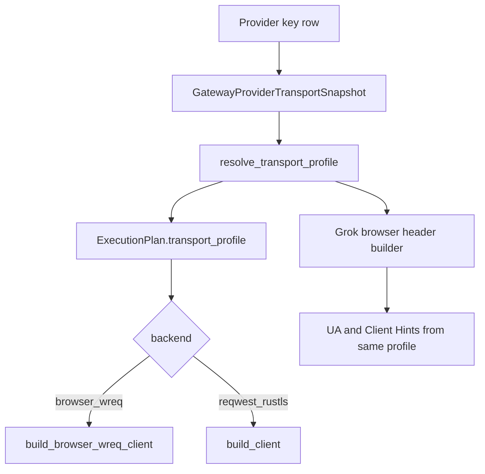

# Design

## Current Model

Aether already has a transport profile contract:

```json
{
  "fingerprint": {
    "transport_profile": {
      "profile_id": "chrome136",
      "backend": "browser_wreq",
      "http_mode": "auto",
      "pool_scope": "key",
      "extra": {
        "browser_profile": "chrome136"
      }
    }
  }
}
```

`ResolvedTransportProfile.backend` is the runtime switch. `browser_wreq` is an
execution capability, not a Grok protocol name.

The old Claude Code fingerprint helper is not directly reusable because its
semantic target is Node/Electron/Stainless headers and it wraps the profile with
`reqwest_rustls`. Grok requires web browser transport behavior and WebSocket
support, so the execution backend still needs `wreq`.

## Target Boundary

* `key.fingerprint.transport_profile`: preferred browser transport truth.
* `provider.config.fingerprint.transport_profile`: provider-level default.
* `key.decrypted_auth_config`: Grok auth material only, with legacy
  `browser_profile` / `user_agent` accepted as fallback.
* `crates/aether-provider-transport`: resolves the profile and builds coherent
  Grok browser headers.
* `apps/aether-gateway/src/execution_runtime/transport.rs`: executes
  `browser_wreq` plans without knowing provider names.

## Resolution Order

1. Key-level `fingerprint.transport_profile`.
2. Provider-level `config.fingerprint.transport_profile`.
3. Grok legacy auth-config fallback:
   `browser_profile`, `browserProfile`, `browser`, `impersonate`.
4. Grok default browser profile.

This order preserves the existing override model and makes migration
non-breaking.

## Profile Normalization

Create a small Grok/browser profile helper in provider transport, not in gateway:

* normalize profile aliases: `chrome-136`, `chrome_136`, `Chrome136` -> `chrome136`.
* expose profile metadata:
  * `profile_id`
  * `wreq browser_profile`
  * `user_agent`
  * `sec-ch-ua`
  * `sec-ch-ua-platform`
* reject unsupported profiles when building the actual `wreq` client.

The gateway should not duplicate `GROK_DEFAULT_USER_AGENT` / `GROK_SEC_CH_UA`
for quota vs runtime. It should consume the provider-transport helper or carry
the resolved profile data in the execution plan/report context where needed.

## Data Flow



## Compatibility

Existing Grok keys are still valid if they only have auth-config
`browser_profile`. The fallback should optionally emit diagnostics indicating
that the account is using legacy profile placement.

New imports should prefer storing browser transport data in
`key.fingerprint.transport_profile`. Auth config can keep `user_agent` only as
legacy input during migration, but it should not become the long-term source of
truth.

## Trade-Offs

### Keep browser profile in auth config only

Pros: smallest patch.

Cons: creates a second configuration system; diagnostics and override behavior
are weaker; maintainers may reject it as Grok-specific drift.

### Move browser profile into fingerprint transport profile

Pros: aligns with existing transport abstraction; provider-agnostic; easier to
document and test; supports future browser-sensitive providers.

Cons: requires migration-compatible import/update logic and a shared profile
helper.

Recommended path: use `fingerprint.transport_profile` as the preferred truth
and keep auth-config fallback for compatibility.

## Testing Strategy

* `aether-provider-transport` tests:
  * key fingerprint wins over provider config and auth-config fallback.
  * provider config wins over auth-config fallback.
  * Grok auth-config fallback creates `browser_wreq`.
  * empty Grok browser metadata creates default `browser_wreq`.
  * browser header builder aligns UA/Client Hints with the resolved profile.
* `aether-gateway` tests:
  * direct sync runtime routes `browser_wreq` in process.
  * unknown browser profile fails loudly.
  * Grok quota plan carries resolved transport profile.
  * Grok WebSocket image path uses the same `build_browser_wreq_client`.
* Diagnostics tests:
  * configured and resolved transport profiles are visible.

## Rollback Shape

The change can be rolled back by removing the import/write-path migration while
keeping the legacy auth-config fallback. Existing runtime `browser_wreq`
execution can remain because it is already the required backend for Grok.
